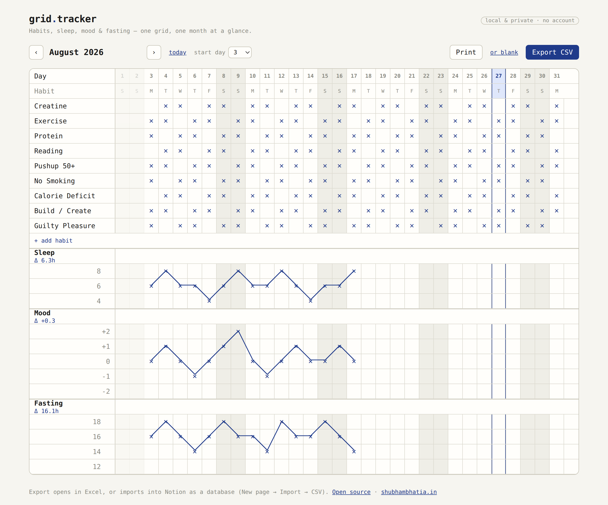

<h1 align="center">grid.tracker</h1>

<p align="center">
  A minimalist, offline-first habit tracker — the paper bullet-journal grid, on the web.
</p>

<p align="center">
  <a href="https://tracker.shubhambhatia.in"></a>
  <a href="./LICENSE"></a>
  <a href="https://vercel.com/new/clone?repository-url=https://github.com/shubhambhatia2103/grid-tracker"></a>
  
</p>

<p align="center">
  
</p>

## What this is

A paper diary spread, rebuilt as a website: days run across the top, habits
down the left, an `✕` per day done. Below the habit grid, three more
click-to-mark rows track **Sleep**, **Mood**, and **Fasting** hours, each with
a running average (`Δ`) and a pen-line trend across the month — exactly like
the hand-drawn version this is based on.

It's built to be used, not configured: no accounts, no setup screen, no
onboarding. Open it, click a cell, done.

## Contents

- [Why it's different](#why-its-different)
- Using it: [habits](#habits) · [sleep, mood & fasting](#sleep-mood--fasting) ·
  [today & start day](#today--start-day) · [print](#print) ·
  [export → Excel or Notion](#export)
- [Run it locally](#run-it-locally)
- [Deploy your own](#deploy-your-own)
- [Data & privacy](#data--privacy)
- [Tech](#tech)
- [Contributing](#contributing)
- [License](#license)

## Why it's different

- **No account, no server, no tracking.** Everything lives in your browser's
  `localStorage`. Your data never leaves your device.
- **Cross-grid everywhere.** Sleep, Mood, and Fasting are click-to-mark ✕
  grids too — not number inputs. It's the same fast interaction as the habit
  row, all the way down.
- **Yours to shape.** Rename habits, add your own, remove what you don't use.
  The starter list is a seed, not a rulebook — your edits become the template
  for future months.
- **Start whenever you actually started.** Forgot to track until the 10th?
  Set the start day and the days before it just get out of the way.
- **Export anywhere.** One click gives you a CSV that opens directly in Excel
  and imports natively into Notion as a database. Or print it — filled in, or
  blank, to fill by hand.
- **Truly minimal.** No chart library, no UI kit, no backend. A static export
  — just a folder of files you can host anywhere.

## Using it

<details open id="habits">
<summary><strong>Habits</strong></summary>
<br>

Click any cell to mark a habit done for that day; click again to clear it.
Click a habit's name to rename it in place — clearing the name removes the
habit entirely. **+ add habit** adds a new row. Whatever the grid looks like
when you're done editing becomes the default for new months.

</details>

<details id="sleep-mood--fasting">
<summary><strong>Sleep, Mood & Fasting</strong></summary>
<br>

Same interaction as habits: click a cell to mark that day's value. Marking a
different value for the same day moves the mark; clicking the already-marked
value clears it. A line traces the marks across the month once there's more
than one, and each section shows a running average (`Δ`).

| Metric  | Y-axis                              |
| ------- | ------------------------------------ |
| Sleep   | Up to 3 values you set (default `8 / 6 / 4`) — click a value to edit it, **+ add value** for another |
| Mood    | Fixed: `+2 / +1 / 0 / −1 / −2`        |
| Fasting | Up to 4 values you set (default `18 / 16 / 14 / 12`) |

</details>

<details id="today--start-day">
<summary><strong>Today & start day</strong></summary>
<br>

The current day's column is highlighted automatically whenever you're
looking at the current month. Use the **start day** dropdown if you didn't
start tracking on the 1st — earlier columns dim out and are left out of the
averages, the trend line, and the CSV export.

</details>

<details id="print">
<summary><strong>Print</strong></summary>
<br>

**Print** sends the month to your printer exactly as tracked. **or blank**
prints the same grid — same habits, same days, same Y-axis values — with
every mark and trend line removed, so you can fill it in by hand. Print
output is a plain black-on-white, single landscape page regardless of your
screen theme.

</details>

<details id="export">
<summary><strong>Export → Excel or Notion</strong></summary>
<br>

**Export CSV** downloads the current month: one row per day, one column per
habit, plus Sleep / Mood / Fasting.

```
Date,Day,Creatine,Exercise,...,Sleep,Mood,Fasting
2026-08-04,Tue,X,,...,6,0,16
```

- **Excel** — just open the file.
- **Notion** — in a page: `New page → Import → CSV`, pick the file. Notion
  builds a database from it that you can filter, sort, and reshape however
  you like.

</details>

## Run it locally

```bash
git clone https://github.com/shubhambhatia2103/grid-tracker.git
cd grid-tracker
npm install
npm run dev      # http://localhost:3000
```

```bash
npm run build    # static export → ./out
```

## Deploy your own

<a href="https://vercel.com/new/clone?repository-url=https://github.com/shubhambhatia2103/grid-tracker">
  
</a>

Or point any Vercel/Netlify/GitHub Pages project at this repo — it's a
standard Next.js static export (`output: "export"`), so `npm run build`
produces a plain folder of files in `out/` that any static host can serve.
No environment variables, no backend to configure.

## Data & privacy

Everything is stored in your browser's `localStorage` under one key. There
is no server, no account, and no analytics — nobody but you can see your
data, including the person who built this. That also means:

- **No cross-device sync.** Your tracker on your phone and your laptop are
  two separate trackers, unless you move data yourself via CSV.
- **Clearing your browser's site data deletes it.** There's no cloud backup.

## Tech

Next.js (App Router) · React · TypeScript · inline-SVG for the trend lines ·
zero runtime dependencies beyond React/Next. `lib/` holds the data model and
pure helpers; `components/Tracker.tsx` is the whole app.

## Contributing

Issues and PRs are welcome — this started as a personal habit tracker turned
open-source template, and it's meant to stay usable by anyone who wants to
track their own habits differently than the default.

Before proposing a feature, take a look at [`CLAUDE.md`](./CLAUDE.md). It's
written for AI coding assistants but doubles as the project's design
philosophy: the decisions already made deliberately, and the ones explicitly
ruled out to keep this minimal. Most feature ideas for this project should
be *rejected*, not built — read that first to see if yours already has an
answer.

## License

[MIT](./LICENSE) — fork it, self-host it, make it yours.
